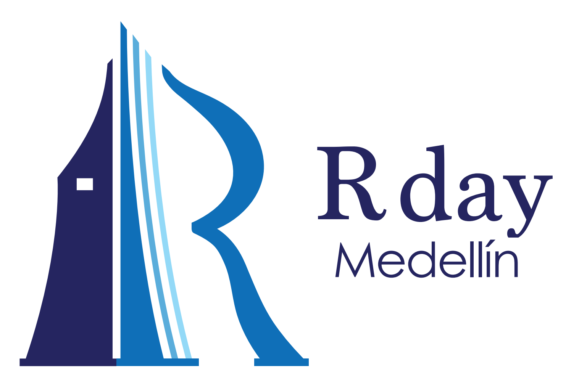

# Plantillas para el [Rday 2019](https://rdaymedellin.github.io)

En este repositorio están las plantillas para el Rday Medellín 2019. Hay tres formas de acceder a las plantillas:

1. Descargando el repositorio en zIP.
2. Clonando el repositorio.
3. Descargando archivo por archivo.

Use la forma con la cual se sienta más cómodo.

